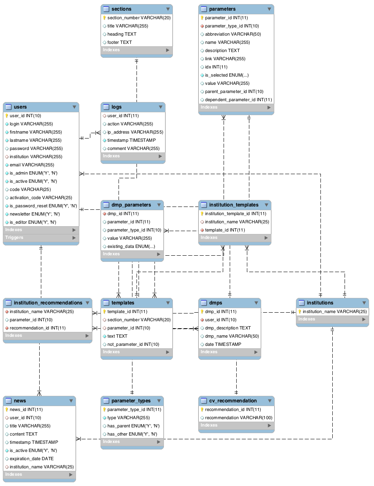

# DMP CANVAS GENERATOR README

## Introduction:
DMP Canvas Generator is a user-friendly questionnaire allowing the construction of a data management plan draft that is extracted as a Word document.
The DMP produced is a canvas, therefore the user needs to complete and validate the information contained in the document.

The web application was built with usage flexibility as a priority. The structure of the generated DMP canvas is independent from the structure of the questionnaire. Therefore, the same questionnaire can potentially be used for different DMP templates.

The construction of the DMP canvas is uniquely based on the database (tables ```parameter_types```, ```parameter```, ```section``` and ```templates```).
***
####DMP Canvas generator dependency
DMP Canvas generator use 
[pandoc](https://pandoc.org/ "pandoc's homepage") to create the word document.
If pandoc is not installed on your computer, please install it as described [here.](https://pandoc.org/installing.html "pandoc's installation page").

***
## How to add a new text:
Does the text that will be added fall into one of the categories defined in the ```parameter_type``` table?
If not, a new category has to be created in the ```parameter_type``` table (see ”how to add a parameter type”). 
Does the text that will be added fall into one of the sections described in the ```sections``` table?
If not, a new section in the ```sections``` table has to be created.
(see ”how to add a section”).

### Remarks: 
Each parameter found in the ```parameters``` table is bound (i.e. corresponds) to a text (see ```templates``` table) and to a ```parameter_type``` (i.e. category). The order according to which the text will be rendered in the Word document is defined by the ```sections``` table.


## How to check if a desired parameter exists: 
To check if a parameter already exists, the first step is to go the ```parameters``` table and check if the name of the desired parameter already exists. If the name already exists, the second step is to the check if the ```parameter_type_id``` matches the desired type. If this is the case, there is a text corresponding to the specific parameter from the specific category already present. To add another text to the parameter see “case specific to an institution”.
If the desired parameter does not exist, see “How to add a parameter type?”.

## How to add a parameter type?
The only attributes that have to be taken into consideration when the table ```parameter_types``` is being filled are the ```has_parent``` and ```has_other``` attributes. ```has_other``` is set to true to declare that the user can enter an option that is not present, using free text. ```has_parent``` is set to true in order to obtain a tree structure, as explained in “database table description”. Generally, this attribute is set to false.
## How to add a section?
To add a section, the ```sections``` table has to be filled.
The position of the section is defined by the ```section_number``` column. It is possible to add a heading and/ or a footer in the corresponding row.
## How to add a new parameter?
The following information about the parameter has to be completed in the table ```parameters``` : 
```parameter_type_id``` (corresponding to the ```parameter_types table```), ```abbreviation```, ```name```, ```description``` (if needed), ‘link’ (if needed), ``` idx``` ( index to choose in which  order to place the parameter in the questionnaire) , ```is_selected``` (Y: checkbox selected. N: checkbox not selected. F: float number. T: text), value (only necessary to give a value to the parameter), ```parent_parameter_id``` (see description below), ```dependent_parameter_id``` (see  description below).
```parent_parameter_id```: used to construct a relation tree as shown in the figure below. For example, it can be used to link a datatype to a metadata standard or a repository. 
```dependent_parameter_id```: Mainly used by the frontend in order to selectively display sections of the questionnaire depending on whether the parameter is selected.

### Remarks: 
Institution specific recommendations can be added to the parameter as described in “case specific to an institution”.
Once the table ```parameters``` is filled, the ```templates``` table has to be completed with the following information:
```section_number``` (the position in the Word document where the text is going to be placed),
```parameter_id``` (allows to bind the text to a parameter of the ```parameters``` table).
### Remarks: 
The ```parameter_id```  has to be set to ```NULL``` for cases where a text will be added when the user selects ```other…``` in the questionnaire. 
In the case of a boolean choice, such as working with human samples or not, if the attribute is not selected (i.e. set to false), the ```parameter_id``` has to be set to NULL, the attribute’s ```parameter_id``` has to be entered in the ```not_parameter_id``` column and the entry has to be filled with the text. 


## Case specific to an institution:
### Add an institution specific text:
To add an institution specific text, the first step is to identify the text that needs to be modified in the ```templates``` table with the help of ```section_number``` and ```parameter_id```.  Then one has to duplicate the row and modify the text. *Tip*: it is important to remember the id of new template!
The second step is to go to the ```institution_templates``` table and add the name of the institution and the id of the template just created.

### Add institution specific recommendations:
Once the id of the desired recommendation has been identified using ```cv_recommendation``` , the id can be added in the ```institution_recommendation``` table together with the ```institution_name``` and the ```parameter_id```.

***

## Database table description:



### cv_recommendation:
Control vocabulary table for the ```institution_recommendation``` table. Each ```recommendation_id``` correspond to a recommendation given by an institution (ex recommended, duplicated, removed).
### debug:
Table used to debug sql command line.
### dmp_parameters:
Table that contains the information necessary to recreate the questionnaires previously filled by a given user.
### dmps:
Table that contains the date of creation of a DMP canvas and the user id in order to be able the reconstruct previous questionnaires filled by the user.
### institution_recommendation:
Table that allows to give a specific recommendation (as recommended it or remove it)  for a given ```parameter_id```  for each institution .
### institution_templates:
Table that allows to have texts specific to an institution. 
If a ```template_id``` is added with its ```institution_name``` the corresponding text specific to the institution would be written in the word document instead of the text nonspecific to an institution.
### institutions
Table that contain the name of all the institution from all the registered users.
### logs:
To be used if someone wants to keep log tracking.
### news:
To be used if someone wants to display news.

### parameter_types:
Very important table for the DMP canvas construction.
All parameters (see **parameters** table) are classified by the different types of this table.

```has_parent``` column allows a construction among the parameters as a tree.
For example, since _datatype_ is bound to _metadata_ and _repositories_, the metadata and the repositories are the children of datatypes (see image below).

```has_other``` column allows to add another option to the parameters list.



### parameters: 
Very important table for the DMP canvas construction.
The column ```is_selected``` allows to choose if a parameter will appear checked in the questionnaire by default. If necessary the ```value``` column is used to give a default value to a parameter, which is especially important when the user selects ```other…``` in the questionnaire. As mentioned in the ```parameter_type``` section, in the table ``` parameter_types``` one can choose if the ```parameter_type``` has a parent. In this case the column ```parent_parameter_id``` allows to complete the parameters tree.

If a parameter is dependent on another one, it has to be specified in the ```dependent_parameter_id``` column. For example, when human data (```parameter_id = 127```)  are used, it is necessary to specify whether the user has the approval of an ethics committee (```parameter_id = 122```). Therefore the ```paremeter_id = 122``` (ethics committee) will have ```dependent_paratemer_id = 127``` (human).

### sections:
The ```section_number``` allows to choose where to place a text and if wanted where to add a ```title``` , a ```heading``` and a ```footer``` for the given section.

### templates:
The ```section_number``` allows to place a text in the desired section.
The text has to be linked to a ```parameter_id```  with the exception of when one wants to add an explanation text. In that case the ```parameter_id``` has to be set to NULL.

In the case of a boolean choice, such as working with human samples or not, if the entity is not selected, one has to set the ```parameter_id``` to NULL, add the entity's ```parameter_id``` to the  ```not_parameter_id``` column and fill the entry corresponding to the true text normally.
Using the previous example, if human has ```parameter_id = 129```, the table should be filled as follows: 
```parameter_id = NULL```, ```text = not human``` , ```not_parameter_id = 129```,
```parameter_id = 129```, ```text = not human``` , ```not_parameter_id = NULL```.

#### Variables inside template tables:
Variables contained in the text are automatically replaced by the corresponding information.

The ```{:name}```variable is replaced with the name of the corresponding ```parameter_id```. When ```other...```is selected, the name is replaced with the name typed in by the user.
The ```{:abbreviation}``` variable is replaced with the abbreviation of the corresponding ```parameter_id```

If one wants to write all selected parameters corresponding to a ```parameter_type``` , the following structure has to be used: ```{::parameter type}``` 
For example: "The produced raw data will be processed using the following tools: ```{::analysis}```."
will produce: "The produced raw data will be processed using the following tools: MATLAB and Spreadsheet files."

Metadata and repositories are constructed as children for the json file that is used by the frontend and therefore have a special variable construction. 
As an example, if one selects genomic data as datatype and the dbSNP as a repository, the variables in the following sentence will be automatically replaced.
 For example:
"```{:name}``` will be deposited in ```{:repositories:name}``` (```{:repositories:link}```)"
will produce: 
"Genomic data will be deposited in dbSNP (https://www.ncbi.nlm.nih.gov/SNP/)."

The data parameters contain values entered by the user which do not fit other categories.
The variables contained in data will be automatically replaced by the values selected by the user.
For example:
"We estimate that a total data volume ranging between ```{:data:volumeMin}```and ```{:data:volumeMax}```will be generated during the course of the project."
will produce:
"We estimate that a total data volume ranging between 100 GB and 1 TB will be generated during the course of the project."


### users:
Used to store all the DMP users.
If the login name is human readable, it means that the user has an account in development mode. Otherwise this is the result of a SWITCHaai login.

### SWITCHaai:
Remarks: the SWITCHaai login is domain name dependent. In order to use the SWITCHaai login the web application domain needs to be registered at 
[SWITCH](https://www.switch.ch/ "Switch link").

