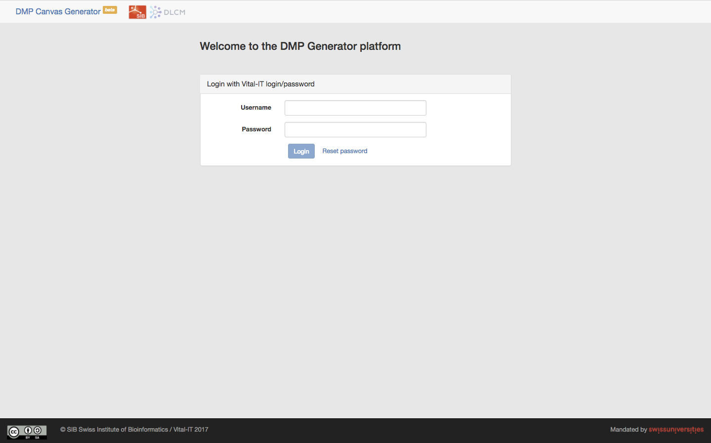
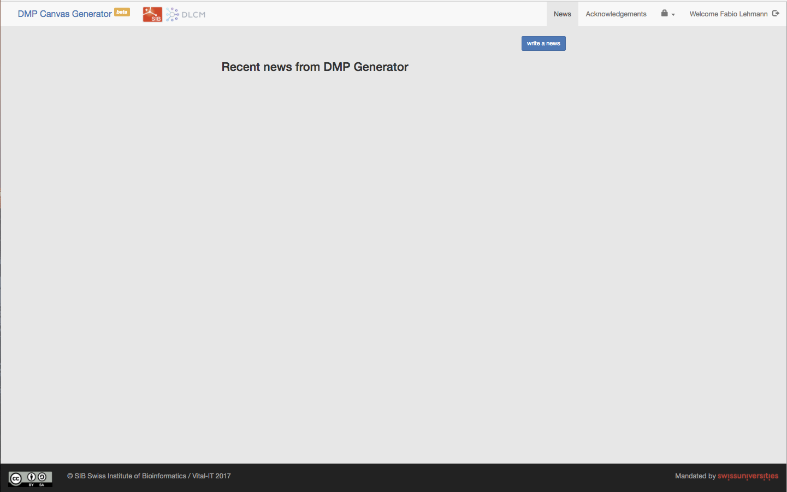

# DMP Canvas Generator


This document will describe the installation and usage of the DMP Canvas Generator.

## Installation

The DMP Canvas Generator application is web-based and is composed of two parts: a server part and a browser front-end.

The server side back-end is a RESTful application written in PHP with the SLIM framework. 

The web side is a JavaScript web application written with the AngularJS, Rectangular and Bootstrap frameworks.

The source code of both parts is versioned using GIT and hosted at [https://github.com/vitalit-sib/vitalit-sib-DMP](https://github.com/vitalit-sib/vitalit-sib-DMP ).

### Backend

> _Prerequisite: The server should have a web server (the system has been tested with Apache) with PHP >=5.6 and the PHP-PDO module installed._

The SIB GitHub repository of the DMP Canvas Generator back-end is: `git://https://github.com/vitalit-sib/vitalit-sib-DMP/tree/master/dmp-backend.git`

To install it: 
```bash
mkdir -p dmp;
cd dmp;
git clone https://github.com/vitalit-sib/vitalit-sib-DMP.git
```

From now on the path of the newly created `dmp` folder will be  referred as:`<path-to-dmp-root>`-

The cloning create a `dmp-backend` directory which contains for directories:

-   **conf:** contains the configuration file config.php
-   **data:** contains a MySQL dump script (dmp.sql)
-   **htdocs:** contains the server side scripts. The PHP library dependencies are managed with Composer. The libraries are in the `vendor` folder whereas the scripts are in the `api` folder.
-   **tools:** contains two files: `db.inc.php` host the initialisation of the database connection. `include.php` contains generic functions.
-   **GIT:** contains the function specific to the version of the web application available on gitHub.

A tutorial to create a Virtual host is available: [https://www.digitalocean.com/community/tutorials/how-to-set-up-apache-virtual-hosts-on-ubuntu-14-04-lts](https://www.digitalocean.com/community/tutorials/how-to-set-up-apache-virtual-hosts-on-ubuntu-14-04-lts)

In order to setup the system, one has to edit the `conf/config.php` file to match the server configuration.

```php
<?php
// The email address of the DMP Canvas Generator administrator
if(!defined("CONTACT_EMAIL")) define("CONTACT_EMAIL","first.last@email.com");

// The name of the  DMP Canvas Generator instance
if(!defined("SITE_TITLE")) define("SITE_TITLE","DMP Canvas Generator");

// Path to the data directory. All datasets will be stored in this directory.
// This directory must be writable by apache user.
if(!defined('DATA_PATH')) define('DATA_PATH',__DIR__."/../data");
// This directory must be writable by apache user.
if(!defined('TMP_PATH')) define('TMP_PATH',"/tmp");

// The type of RDBMS to use
if(!defined("DBTYPE")) define("DBTYPE","sqlite");

// For MySQL connection
if(!defined("DBBASE")) define("DBBASE","mysql_database");
if(!defined("DBSERVER")) define("DBSERVER","mysql_server");
if(!defined("DBNAME")) define("DBNAME","mysql_username");
if(!defined("DBPWD")) define("DBPWD","mysql_user_password");

// For Sqlite3 connection. Path to the DB file
if(!defined("DBFILE")) define("DBFILE",DATA_PATH."/database.sqlite");

// Path to the tools directory
if(!defined('INCLUDE_PATH')) define("INCLUDE_PATH",dirname(__FILE__)."/../tools/");

// Whether to server should accept Cross-Origin request or not. Should be set to false in production.
if(!defined('CORS')) define('CORS',true);

// Set the debug state of the application. Might be used to display some debugging messages
if(!defined('DEBUG')) define('DEBUG',true);

// Path to pandoc reference
// pandoc has to be install on the machine !
if(!defined('PANDOC_REFERENCE')) define('PANDOC_REFERENCE',"/path/to/.pandoc/reference.docx")?>
```

If DMP Canvas Generator is used with a MySQL database, one has to change the DBTYPE value and un-comment the part related to MySQL connection.

**IMPORTANT:** be sure that the DATA\_PATH is writable by the web server (apache) user.

A part of this web application is based on [ViKM (version 2)](http://www.vital-it.ch/research/software/ViKM). All ViKM database connections are managed by [Medoo framework](http://medoo.in/). This framework supports various SQL databases. Database connections specific to the DMP Canvas Generator are coded in MySQL with [Meekro](http://www.meekro.com) which offers an easier interface and supports advanced, MySQL specific features. DMP Canvas Generator uses the

DMP Canvas Generator uses the [SLIM PHP Framework (version 2)](http://www.slimframework.com/) to handle the routing of the RESTful application.

To get the required external libraries: 

```bash
cd <path-to-dmp-root>/dmp-backend/htdocs;
php composer.phar update;
```

## Frontend

> _prerequisite: The DMP Canvas Generator frontend is developed with the following technologies:_
> 
>	- [NodeJS](https://nodejs.org) JavaScript runtime
>	- [Bower](https://bower.io) package manager
>	- [Grunt](http://gruntjs.com) task runner
>
>	Make sure to have all these components installed on your system in order to deploy the web application._

The SIB GitHub repository of DMP Canvas Generator frontend is: `https://github.com/vitalit-sib/vitalit-sib-DMP/tree/master/dmp-ng`

To install it: 
```bash
cd <path-to-dmp-root>;
git clone https://github.com/vitalit-sib/vitalit-sib-DMP.git
```

Once this directory cloned, the necessary Node modules and bower components must be installed. 

```bash
cd <path-to-dmp-root>/dmp-ng/;
npm install;
bower install;
```

This will install modules in two folders;`node_modules` and `bower components`.
The html, JavaScript and css files of the application are in the `app` folder.

The development and deployment of the front-end is managed by Grunt. The included Gruntfile.js can be customized to fit your settings: especially, the `constants->serverURL`. In the following example, we assume that a virtual host named 'dmp' points to `<path-to-dmp-root>/dmp-backend/htdocs`.
 

```javascript
    ngconstant: {
    	  // Options for all targets
    	  options: {
    		  space: '  ',
    		  wrap: '"use strict";\n\n ',
    		  name: 'config',
    	  },
    	  // Environment targets
    	  development: {
    		  options: {
    			  dest: '<%= yeoman.app %>/scripts/config.js'
    		  },
    		  constants: {
    			  ENV: {
    				  serverURL: 'http://dmp/api/index.php/',
    				  withCredentials: true,
    				  debugInfoEnabled: true,
    				  CORS: true
    			  }
    		  }
    	  },
    	  production: {
    		  options: {
    			  dest: '<%= yeoman.app %>/scripts/config.js'
    		  },
    		  constants: {
    			  ENV: {
    				  serverURL: 'api/',
    				  withCredentials: false,
    				  debugInfoEnabled: false,
    				  CORS: false
    			  }
    		  }
    	  }
    },
```

This part contains two important sections: *development* and *production*. Depending on whether the app is under development or deployed in production, different constants are set accordingly: 

- *serverURL:* the URL of the PHP backend. Must link to the api/index.php. 
- *withCredentials:* in development, two different web servers are used (the front-end is served on port 9000 and the backend on port 80). To allow Cross-Origin-Resource Sharing, this value must be set to *true*. In production mode, both front-end and back-end are served by the same web server, so set this constant to *false*.
- *CORS*: same as for *withCredentials*
- *debugInfoEnabled:* internal constant to be used in development to log some messages on the console. We don't want those messages to appear in a production mode.

>***enabling bootstrap***
>
> Bootstrap is used as a layout framework
> By default, bower deploys the *.less* version, but it is easier to simply include the *.css* version. 
> To do so, edit: `<path-to-dmp-root>/dmp-ng/bower_components/bootstrap/bower.json`
> and replace `less/bootstrap.less` by `dist/css/bootstrap.css`.
> Optionaly, we can add `dist/css/bootstrap-theme.css`.

The development environment can be started by running the following command in the dmp-ng directory. 
`grunt serve`
This should open Chrome at `http://localhost:9000/#/`. If not, open it manually.

 
### Customisation

- To rename the instance of DMP Canvas Generator, edit the file `app/scripts/app.js` at line: 
`.constant('siteTitle',{name: 'DMP Canvas Generator'})`
Replace DMP Canvas Generator with the new name.

- To replace the generic logo of DMP Canvas Generator with the logo of the project or platform, replace the image file: `app/images/icon_webapp.png`. The image must have a height of at least 32px.

- If the installation of DMP Canvas Generator must be monitored by Google Analytics, put the Google Analytics code in the corresponding section of the 
`index.html` file.


```javascript
		<!-- Google Analytics: change UA-XXXXX-X to be your site's ID -->
		<script>
		(function(i,s,o,g,r,a,m){i['GoogleAnalyticsObject']=r;i[r]=i[r]||function(){
			(i[r].q=i[r].q||[]).push(arguments)},i[r].l=1*new Date();a=s.createElement(o),
			m=s.getElementsByTagName(o)[0];a.async=1;a.src=g;m.parentNode.insertBefore(a,m)
		})(window,document,'script','//www.google-analytics.com/analytics.js','ga');

		ga('create', 'UA-XXXXX-X');
		ga('send', 'page view');
		</script>
```

- DMP Canvas Generator is using [Bootstrap v3](http://getbootstrap.com/) as a layout framework. Several themes (free or commercial) exist to customise the appearance of the web application. 


### Testing
The login interface should be displayed in the browser window:



By default, an *admin* account is created with:

- login: *admin*
- password: *admin*

You should be able to log in and access the `News` section.



##add a part on the login 

## Deployment
To deploy the DMP Canvas Generator instance on a production server, `grunt` is used to package the front-end and minify its code. 
In the web application root directory, launch the command:

```bash
grunt build;
```
The result of this command is available in the `dist` folder of the web application. Copy the content of this folder in the `htdocs` directory of the production server. Copy (or clone) there as well the back-end part of the DMP Canvas Generator application.


# Licence
*This program is free software: you can redistribute it and/or modify it under the terms of the GNU Affero General Public License as published by the Free Software Foundation, either version 3 of the License, or (at your option) any later version.*
*This program is distributed in the hope that it will be useful, but WITHOUT ANY WARRANTY; without even the implied warranty of MERCHANTABILITY or FITNESS FOR A PARTICULAR PURPOSE.  See the GNU Affero General Public License for more details.*
*You should have received a copy of the GNU General Public License along with this program.  If not, see [http://www.gnu.org/licenses/](http://www.gnu.org/licenses/).*
